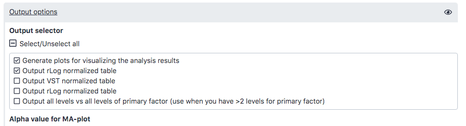
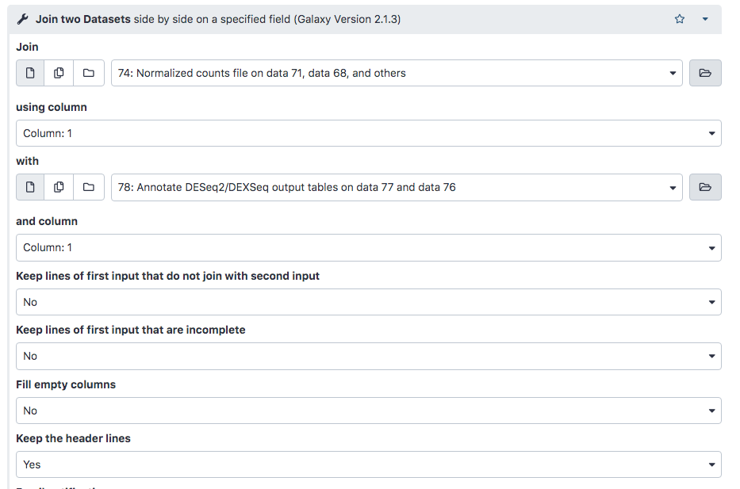
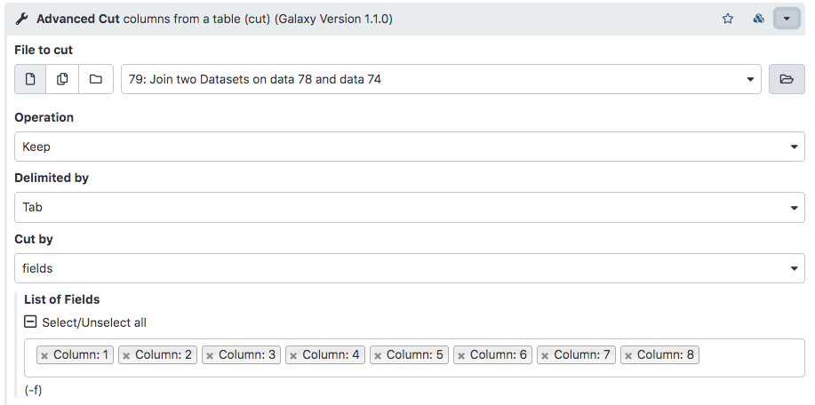
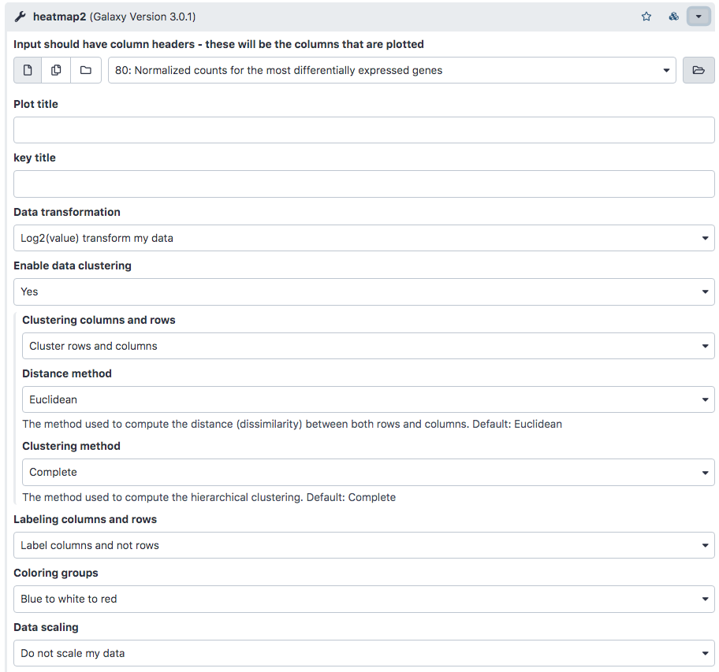

# Introduction

In recent years, RNA sequencing (in short RNA-Seq) has become a very widely used technology to analyze the continuously changing cellular transcriptome, i.e. the set of all RNA molecules in one cell or a population of cells. One of the most common aims of RNA-Seq is the profiling of gene expression by identifying genes or molecular pathways that are differentially expressed (DE) between two or more biological conditions. This tutorial demonstrates a computational workflow for the detection of DE genes and pathways from RNA-Seq data by providing a complete analysis of an RNA-Seq experiment profiling Drosophila cells after the depletion of a regulatory gene.

In the study of Brooks et al. 2011, the authors identified genes and pathways regulated by the Pasilla gene (the Drosophila homologue of the mammalian splicing regulators Nova-1 and Nova-2 proteins) using RNA-Seq data. They depleted the Pasilla (PS) gene in Drosophila melanogaster by RNA interference (RNAi). Total RNA was then isolated and used to prepare both single-end and paired-end RNA-Seq libraries for treated (PS depleted) and untreated samples. These libraries were sequenced to obtain RNA-Seq reads for each sample. The RNA-Seq data for the treated and the untreated samples can be compared to identify the effects of Pasilla gene depletion on gene expression.

In this tutorial, we illustrate the analysis of the gene expression data step by step using 7 of the original datasets:

-   4 untreated samples: GSM461176, GSM461177, GSM461178, GSM461182
-   3 treated samples (Pasilla gene depleted by RNAi): GSM461179, GSM461180, GSM461181

Each sample constitutes a separate biological replicate of the corresponding condition (treated or untreated). Moreover, two of the treated and two of the untreated samples are from a paired-end sequencing assay, while the remaining samples are from a single-end sequencing experiment.

# Analysis of the differential gene expression
## Identification of the differentially expressed features

To be able to identify differential gene expression induced by PS depletion, all datasets (3 treated and 4 untreated) must be analyzed following the same procedure. To save time, we have run the previous steps for you. We then obtain 7 files with the counts for each gene of Drosophila for each sample.

### Import all count files 
1. Create a new empty history
2. Import the seven count files from Zenodo or the Shared Data library. Click on the 'Upload data button', press 'Paste/Fetch data' and copy the links below: 

```
https://zenodo.org/record/4541751/files/GSM461176_untreat_single.counts
https://zenodo.org/record/4541751/files/GSM461177_untreat_paired.counts
https://zenodo.org/record/4541751/files/GSM461178_untreat_paired.counts
https://zenodo.org/record/4541751/files/GSM461179_treat_single.counts
https://zenodo.org/record/4541751/files/GSM461180_treat_paired.counts
https://zenodo.org/record/4541751/files/GSM461181_treat_paired.counts
https://zenodo.org/record/4541751/files/GSM461182_untreat_single.counts

```


### Determine differentially expressed genes with DESeq2
Select [DESeq2](https://usegalaxy.org/root?tool_id=toolshed.g2.bx.psu.edu/repos/iuc/deseq2/deseq2/2.11.40.6+galaxy2) from the available resources . Run the program with the following parameters:

- “how”: Select `datasets per level`
- In “1: Factor”
  -   “Specify a factor name”: `Treatment`
- In “1: Factor level”:
  -   “Specify a factor level”: `treated`
  -   “Counts file(s)”: the 3 gene count files with `treat` in their name
-   In “2: Factor level”:
  -   “Specify a factor level”: `untreated`
  -   “Counts file(s)”: the 4 gene count files with `untreat` in their name
- Click on “Insert Factor” (*not* on “Insert Factor level”)
  -   In “2: Factor”
    -   “Specify a factor name”: `Sequencing`
  -   In “2: Factor level”:
    -   “Specify a factor level”: `PE`
    -   “Counts file(s)”: the 3 gene count files with `paired` in their name
  -   In “2: Factor level”:
    -   “Specify a factor level”: `SE`
    -   “Counts file(s)”: the 4 gene count files with `single` in their name

- “Files have header?”: `No`
- “Visualising the analysis results”: `Yes`
- “Output normalized counts table”: `Yes`


DESeq2 generated 3 outputs:

  1. A table with the normalized counts for each gene (rows) in the samples (columns)
  2. A graphical summary of the results, useful to evaluate the quality of the experiment:
  -   A plot of the first 2 dimensions from a principal component analysis (**PCA**), run on the normalized counts of the samples
  -   **Heatmap of the sample-to-sample distance matrix** (with clustering) based on the normalized counts.
  -    **Dispersion estimates**: gene-wise estimates (black), the fitted values (red), and the final maximum a posteriori estimates used in testing (blue). This dispersion plot is typical, with the final estimates shrunk from the gene-wise estimates towards the fitted estimates. Some gene-wise estimates are flagged as outliers and not shrunk towards the fitted value. The amount of shrinkage can be more or less than seen here, depending on the sample size, the number of coefficients, the row mean and the variability of the gene-wise estimates.
  -   **Histogram of p-values** for the genes in the comparison between the 2 levels of the 1st factor
  - An **MA plot**: This displays the global view of the relationship between the expression change of conditions (log ratios, M), the average expression strength of the genes (average mean, A), and the ability of the algorithm to detect differential gene expression. The genes that passed the significance threshold (adjusted p-value < 0.1) are colored in red.
  3. A summary file with the following values for each gene:
  - **Gene identifiers**
  -Mean normalized counts, averaged over all samples from both conditions
  - **Fold change in log2** (logarithm base 2): The log2 fold changes are based on the primary factor level 1 vs factor level 2, hence the input order of factor levels is important. Here, DESeq2 computes fold changes of ‘treated’ samples against ‘untreated’ from the first factor ‘Treatment’, i.e. the values correspond to up- or downregulation of genes in treated samples.
  - Standard error estimate for the log2 fold change estimate
  - Wald statistic
  - p-value for the statistical significance of this change
  - **p-value adjusted** for multiple testing with the Benjamini-Hochberg procedure, which controls false discovery rate (FDR)

## Extraction and annotation of differentially expressed genes
Now we would like to extract the most differentially expressed genes due to the treatment and with an absolute fold change > 2. 
Select the [FIlter](https://usegalaxy.org/root?tool_id=Filter1) Tool to extract genes with a significant change in gene expression (adjusted p-value below 0.05) between treated and untreated samples:

  -   “Filter”: the DESeq2 result file
  -   “With following condition”: `c7<0.05` 

Rename the output `Genes with significant adj p-value`.

We will now select only the genes with an absolute fold change (FC) > 2. Note that the DESeq2 output file contains log2FC, rather than FC itself, so we filter for **abs(log2FC)>1** (which implies FC > 2).
Use the [FIlter](https://usegalaxy.org/root?tool_id=Filter1) tool again to extract genes with an abs(log2FC)>1:

  -   “Filter”: `Genes with significant adj p-value`
  -   “With following condition”: `abs(c3)>1`
  
Rename the output `Genes with significant adj p-value and abs(logFC)>1`

#### Questions
1. How many genes have a significant change in gene expression and a significant p.value?
2. How many significant genes remain after fitering for abs(logFC)>1?

### Annotation of DE genes 
The ID for each gene is something like FBgn0003360, which is an ID from the corresponding database, here Flybase (Thurmond et al. 2018). These IDs are unique but sometimes we prefer to have the gene names, even if they may not reference an unique gene (e.g. duplicated after re-annotation). But gene names may hint already to a function or they help you to search for desired candidates. We would also like to display the location of these genes within the genome. We can extract such information from the annotation file which we used for mapping and counting.

1. Import the Ensembl gene annotation for Drosophila melanogaster (Drosophila_melanogaster.BDGP6.87.gtf) from Zenodo:

  - Click on 'Upload data', then 'Paste/Fetch Data' and copy the following:
```
https://zenodo.org/record/4541751/files/Drosophila_melanogaster.BDGP6.87.gtf
```
2.  Once it's loaded on your history, select the tool [Annotate DESeq2/DEXSeq output tables](https://usegalaxy.org/root?tool_id=toolshed.g2.bx.psu.edu/repos/iuc/deg_annotate/deg_annotate/1.1.0)

  - “Tabular output of DESeq2/edgeR/limma/DEXSeq”: output of the last filter, `Genes with significant adj p-value and abs(logFC)>1`
  - “Input file type”: DESeq2/edgeR/limma
  -  “Reference annotation in GFF/GTF format”: imported GTF file


The generated output is an extension of the previous file:

  -   Gene identifiers
  -   Mean normalized counts over all samples
  -   Log2 fold change
  -   Standard error estimate for the log2 fold change estimate
  -   Wald statistic
  -   p-value for the Wald statistic
  -   p-value adjusted for multiple testing with the Benjamini-Hochberg procedure for the Wald statistic
  -   Chromosome
  -   Start
  -   End
  -   Strand
  -   Feature
  -   Gene name
  
#### Questions 
1. Where is the most over-expressed gene located?
2. What is the name of the gene?

## Visualization of the expression of the differentially expressed genes
To extract the normalized counts for the interesting genes, we join the normalized count table generated by DESeq2 with the table we just generated. We will then keep only the lines corresponding to the most differentially expressed genes.
Select the [Join two Datasets](https://usegalaxy.org/root?tool_id=join1) Tool and run it with the following parameters:

  - “Join”: the Normalized counts file (output of DESeq2)
  -   “using column”: Column: 1
  -  “with”: `Genes with significant adj p-value and abs(logFC)>1`
  -   “and column”: Column: 1
  -   “Keep lines of first input that do not join with second input”: No
  -   “Keep the header lines”: Yes


The generated file has more columns than we need for the heatmap: mean normalized counts, log2FC and other annotation information. We need to remove the extra columns.

Use [Cut](https://usegalaxy.org/root?tool_id=toolshed.g2.bx.psu.edu/repos/bgruening/text_processing/tp_cut_tool/1.1.0) to extract the columns with the gene IDs and normalized counts:

  - “Cut columns”: c1-c8
  -“Delimited by”: Tab
  -“From”: the joined dataset (output of Join two Datasets)

Rename the output to `Normalized counts for the most differentially expressed genes.`

We now have a table with 130 lines (the most differentially expressed genes) and the normalized counts for these genes across the 7 samples. We can move onto plotting the heatmap.
Select [heatmap2](https://usegalaxy.org/root?tool_id=toolshed.g2.bx.psu.edu/repos/iuc/ggplot2_heatmap2/ggplot2_heatmap2/3.0.1) to plot the differentially expressed genes with the following parameters:

  - “Input should have column headers”: Normalized counts for the most differentially expressed genes
  - “Advanced - log transformation”/“Data transformation”: `Log2(value) transform my data`
  - “Enable data clustering”: `Yes`
  - “Labeling columns and rows”: `Label columns and not rows`
  - “Coloring groups”: `Blue to white to red`



## Functional enrichment of differentially expressed genes 
We have extracted genes that are differentially expressed in treated (PS gene-depleted) samples compared to untreated samples. Now, we would like to know if the differentially expressed genes are enriched transcripts of genes which belong to more common or specific categories in order to identify biological functions that might be impacted.

### Gene Ontology analysis
Gene Ontology (GO) analysis is widely used to reduce complexity and highlight biological processes in genome-wide expression studies. However, standard methods give biased results on RNA-Seq data due to over-detection of differential expression for long and highly-expressed transcripts.

[goseq](https://usegalaxy.org/root?tool_id=toolshed.g2.bx.psu.edu/repos/iuc/goseq/goseq/1.44.0+galaxy0) (Young et al. 2010) provides methods for performing GO analysis of RNA-Seq data while taking length bias into account. goseq could also be applied to other category-based tests of RNA-Seq data, such as KEGG pathway analysis, as discussed in a further section.

goseq needs 2 files as inputs:

  - A tabular file with the differentially expressed genes from all genes assayed in the RNA-Seq experiment with 2 columns:
    - the Gene IDs (unique within the file), in uppercase letters
    - a **boolean** indicating whether the gene is differentially expressed or not (True if differentially expressed or False if not)
  - A file with information about the length of a gene to correct for potential length bias in differentially expressed genes
  
We will first prepare the datasets to get the right format, then run goseq. 

### Preparation of the Gene ID file 
Start with the [Compute](https://usegalaxy.org/root?tool_id=toolshed.g2.bx.psu.edu/repos/devteam/column_maker/Add_a_column1/1.6) Tool: 

  - “Add expression”: `bool(c7<0.05)`
  - “as a new column to”: the DESeq2 result file

Then use the Cut Tool: 

  - “Cut columns”: `c1,c8`
  - “Delimited by”: Tab
  - “From”: the output of the Compute

Finally, [Change Case](https://usegalaxy.org/root?tool_id=ChangeCase) Tool: 

  - “From”: the output of the previous Cut
  - “Change case of columns”: c1
  - “Delimited by”: Tab
  - “To”: Upper case


Rename the output to `Gene IDs and differential expression`

### Run goseq 
As second input for goseq we need the gene lengths. Upload the file of gene lengths generated with featureCounts provided by us (Gene_ids_and_length.tabular). Once it's in the history, we can run goseq with the following parameters:

  - “Differentially expressed genes file”: `Gene IDs and differential expression`
  - “Gene lengths file”: `Gene IDs and length`
  - “Gene categories”: `Get categories`
  - “Select a genome to use”: `Fruit fly (dm6)`
  - “Select Gene ID format”: `Ensembl Gene ID`
  - “Select one or more categories”: `GO: Cellular Component, GO: Biological Process, GO: Molecular Function`
  - In “Output Options”
    -   “Output Top GO terms plot?”: Yes
    -    “Extract the DE genes for the categories (GO/KEGG terms)?”: Yes


goseq generates with these parameters 3 outputs:

1. A table (Ranked category list - Wallenius method) with the following columns for each GO term:

    - category: GO category
    - over_rep_pval: p-value for over-representation of the term in the differentially expressed genes
    - under_rep_pval: p-value for under-representation of the term in the differentially expressed genes
    - numDEInCat: number of differentially expressed genes in this category
    - numInCat: number of genes in this category
    - term: detail of the term
    - ontology: MF (Molecular Function - molecular activities of gene products), CC (Cellular Component - where gene products are active), BP (Biological Process - pathways and larger processes made up of the activities of multiple gene products)
    - p.adjust.over_represented: p-value for over-representation of the term in the differentially expressed genes, adjusted for multiple testing with the Benjamini-Hochberg procedure
    - p.adjust.under_represented: p-value for under-representation of the term in the differentially expressed genes, adjusted for multiple testing with the Benjamini-Hochberg procedure. To identify categories significantly enriched/unenriched below some p-value cutoff, it is necessary to use the adjusted p-value.

2. A graph with the top 10 over-represented GO terms
3. A table with the differentially expressed genes (from the list we provided) associated to the GO terms (DE genes for categories (GO/KEGG terms))

#### Questions 
1.How many GO terms are over-represented with an adjusted P-value < 0.05? How many are under-represented?

2.How are the over-represented GO terms divided into MF, CC and BP? And for under-represented GO terms?

## KEGG Pathway Analysis
goseq can also be used to identify interesting KEGG pathways. The KEGG pathway database is a collection of pathway maps representing current knowledge of molecular interaction, reaction and relation networks. A map can integrate many entities including genes, proteins, RNAs, chemical compounds, glycans, and chemical reactions, as well as disease genes and drug targets.

Use goseq again, but this time select `KEGG` in 'Gene Categories'-> 'Select one or more categories'.  

#### Questions
1. How many KEGG pathways terms have been identified?
2. How many KEGG pathways terms are over-represented with an adjusted P value < 0.05?
3. What are the over-represented KEGG pathways terms?
4. How many KEGG pathways terms are under-represented with an adjusted P value < 0.05?

## Pathway visualization with pathview
We could investigate which genes are involved in which pathways by looking at the second file generated by goseq. However, this can be cumbersome and we would like to see the pathways as represented in the previous image. Pathview (Luo and Brouwer 2013) can help to automatically generate similar images to the previous one, while also adding extra information about the genes (e.g. expression) in our study.

This tool needs 2 main inputs:

- **Pathway ID(s)** to plot, either as just one ID or as a file with one column with the pathway IDs
- A tabular file with the **genes** in the RNA-Seq experiment with 2 (or more) columns:
    - the gene IDs (unique within the file)
    - some information about the genes. This can be for example a p-value or a fold change. This information will be added to the pathway plot: the node of the corresponding gene will be colored given the value. If there are different columns, the different information will be plotted side by side on the node.

Here we would like to visualize the 2 KEGG pathways: the over-represented 00010 (Glycolysis / Gluconeogenesis) and the under-represented 03040 (Spliceosome). We would like the gene nodes to be colored by Log2 Fold Change for the differentially expressed genes because of the treatment.

To generate a list of gene ids and their log2FC, use the Cut Tool with:

  - “Cut columns”: c1,c3
  - “Delimited by”: Tab
  - “From”: Genes with significant adj p-value

Rename to `Genes with significant adj p-value and their Log2 FC`

Use [Pathview](https://usegalaxy.org/root?tool_id=toolshed.g2.bx.psu.edu/repos/iuc/pathview/pathview/1.24.0+galaxy0) with

  -   “Number of pathways to plot”: Single 
  -   “KEGG pathways”: KEGG pathways to plot (es 00010)
  -   “Does the file have header (a first line with column names)?”: No
  -   “Species to use”: Fly
  -   “Provide a gene data file?”: Yes
  -    “Gene data”: Genes with significant adj p-value and their Log2 FC
  -   “Does the file have header (a first line with column names)?”: No
  -   “Format for gene data”: Ensembl Gene ID
  -   “Provide a compound data file?”: No
  - In “Output Options”
    - “Output for pathway”: KEGG native
    - “Plot on same layer?”: Yes


#### Questions

1. In the pathview-generated plot, what are the colored boxes?
2. What is the color code?