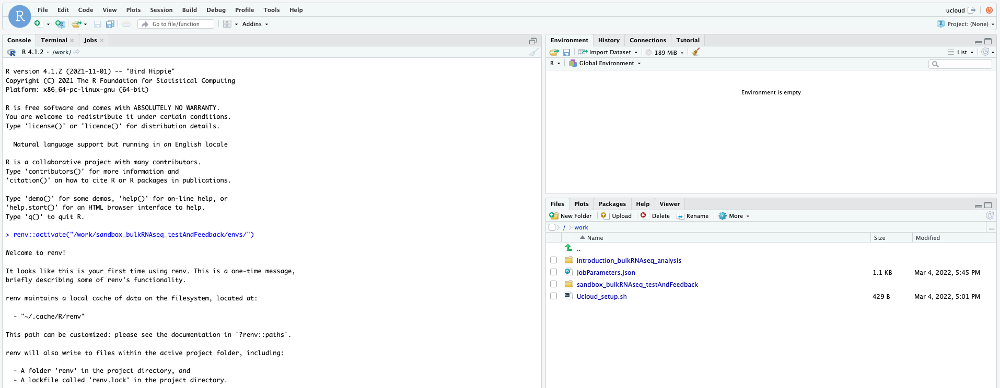

# Setup for teaching in uCloud

In what follows you have the setup guide for the possible hardware where you are running the course material.

## For Ucloud users

Access to [Ucloud](https://cloud.sdu.dk) with your account and choose the project `Health data science sandbox` where you have been invited.


Click on `Apps` on the left-side menu, and look for the application `Rstudio v4.1.2`.


Once the app is chosen, click on `Run application` on the right-hand side of the screen. You will be met with a series of possible parameters to choose. You have to assign:

- job name: simply any name given to the app execution
- hours: how long you are using the app. You can choose as many hours as the course session lasts. Or just a couple of hours to do some exercises. You can always add extra time while using the app, or run it again with the same settings (they will be saved under the name you chose as `job name`)
- Machine type: it is sufficient to choose a machine with 4 vCPUs.


- Dependencies: commands that will run automatically when starting the app. Choose the same file as in the picture (`projects/sandbox_bulkRNAseq_testAndFeedback/bulkRNAseq_course/Scripts/Ucloud_setup.sh`), it will get all the necessary files and folders.

- Select folders to use: makes specific folders usable by the app. Choose the same folder as in the picture (`projects/sandbox_bulkRNAseq_testAndFeedback`), it contains the data.


You are ready to run the app by clicking on the button on the right column of the screen (`submit`).


Now, wait some time until the screen will look like in the figure below. It usually takes a few minutes for everything to be ready and installed. You can always come back to this screen from the left menu `Runs` on uCloud, so that you can add extra time or stop the app if you will not use it.


Now, click on `open interface` on the top right-hand side of the screen. You will start Rstudio through your browser!

**Important note** First of all, run the following command. It will load all the necessary packages to run the course. Answer "yes" to the prompt `Do you want to proceed? [y/N]: Y`

``` R
renv::activate("/work/sandbox_bulkRNAseq_testAndFeedback/envs/")
```




On the lower right side of Rstudio, where you see the file explorer, access the folder `introduction_bulkRNAseq_analysis`. Here you will find the notebooks containing the code to run. Just open them (in order from the first one) and run the code you want - the first command always takes a couple of minutes to allow the machine creating some configuration files in background. You can explore beforehand all the jupyter notebooks already compiled on this webpage.

**Important**: when you are done, go on `Runs` in uCloud, and choose your app if it is still running. Then you will be able to stop it from using resources. Your material will be saved in a volume with your username, that you should be able to see under the menu `Files`.

