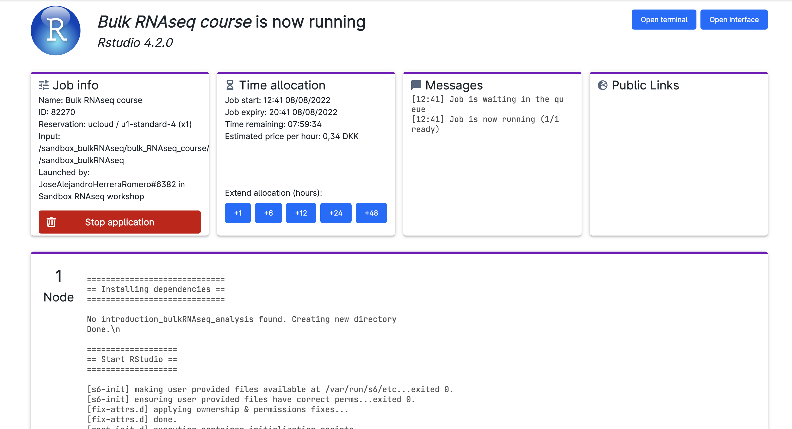

# Setup for teaching in uCloud

Access to [Ucloud](https://cloud.sdu.dk) with your account and choose the project `Health data science sandbox` where you have been invited.

Click on `Apps` on the left-side menu, and look for the application `Rstudio v4.1.2` and click on it.

You will be met with a series of possible parameters to choose. You have to assign:

- job name: give your job a name you would like. For example: bulk-RNAseq course.
- hours: how long you are using the app. You can choose as many hours as the course session lasts. Or just a couple of hours to do some exercises. You can always add extra time while using the app, or run it again with the same settings (they will be saved under the name you chose as `job name`)
- Machine type: it is sufficient to choose a machine with 4 vCPUs.

- Dependencies: commands that will run automatically when starting the app. It will get all the necessary files and folders to run the course. 
  Choose the same file as in the picture. Either:
  * Go to `hds-sandbox → projects → sandbox_bulkRNAseq_testAndFeedback → bulkRNAseq_course  → Scripts  → Ucloud_setup.sh`, click “Use”. 
  * Or copy-paste this path: `/hds-sandbox/projects/sandbox_bulkRNAseq_testAndFeedback/bulk_RNAseq_course/Scripts/Ucloud_setup.sh`.

- Select folders to use: makes specific folders usable by the app. The folder below contains the data used in this course.
  Choose the same folder as in the picture. Either:
  * Go to `hds-sandbox → projects → sandbox_bulkRNAseq_testAndFeedback`, click “Use.”
  * Or copy-paste this path: `/hds-sandbox/projects/sandbox_bulkRNAseq_testAndFeedback`.

You are ready to run the app by clicking on the button on the right column of the screen (`submit`).

Now, wait some time until the screen looks like the figure below. It usually takes a few minutes for everything to be ready and installed. You can always come back to this screen from the left menu Runs on uCloud, so that you can add extra time or stop the app if you will not use it.

Now, click on `open interface` on the top right-hand side of the screen. You will start Rstudio through your browser!

On the lower right side of Rstudio, where you see the file explorer, access the folder `introduction_bulkRNAseq_analysis`. Here you will find the notebooks containing the code used in the course. There are still some theory lessons before we start coding, so keep following the material!

**Important**: when you are done, go on `Runs` in uCloud, and choose your app if it is still running. Then you will be able to stop it from using resources. Your material will be saved in a volume with your username, that you should be able to see under the menu `Files`.

# Restarting the Rstudio session

After running a first Rstudio session, everything that you have created, including the scripts and results of your analysis, will be saved in your own personal *"Jobs"* folder. Inside this folder there will be a subfolder called *Rstudio*, which will contain all the jobs you have run with Rstudio. Inside this folder, you will find your folder named after the job name you gave in the previous step. If you want to keep working on your previous results, you can restart an Rstudio session following these steps:

Click on `Apps` on the left-side menu, and look for the application `Rstudio v4.1.2` and click on it.

You will be met again with a series of possible parameters to choose. You have to assign again "job name" and "hours"

For dependencies, you will choose a different dependency file
  Choose the same file as in the picture. Either:
  
  * Go to `hds-sandbox → projects → sandbox_bulkRNAseq_testAndFeedback → bulkRNAseq_course  → Scripts  → Ucloud_restart.sh`, click “Use”. 
  * Or copy-paste this path: `/hds-sandbox/projects/sandbox_bulkRNAseq_testAndFeedback/bulk_RNAseq_course/Scripts/Ucloud_restart.sh`.

In *"Select folders to use"*, add the same folder as before:

  * Go to `hds-sandbox → projects → sandbox_bulkRNAseq_testAndFeedback`, click “Use.”
  * Or copy-paste this path: `/hds-sandbox/projects/sandbox_bulkRNAseq_testAndFeedback`.

In addition, add the the folder with the results of your previous job:

  * Go to `Member Files: your_username → Jobs → Rstudio → job_name → introduction_bulkRNAseq_analysis`, click “Use.”

You are ready to run the app by clicking on the button on the right column of the screen (`submit`). After opening the Rstudio interface, you should be able to access the folder `introduction_bulkRNAseq_analysis`, where you will find the your course notebooks and results from your previous work!

