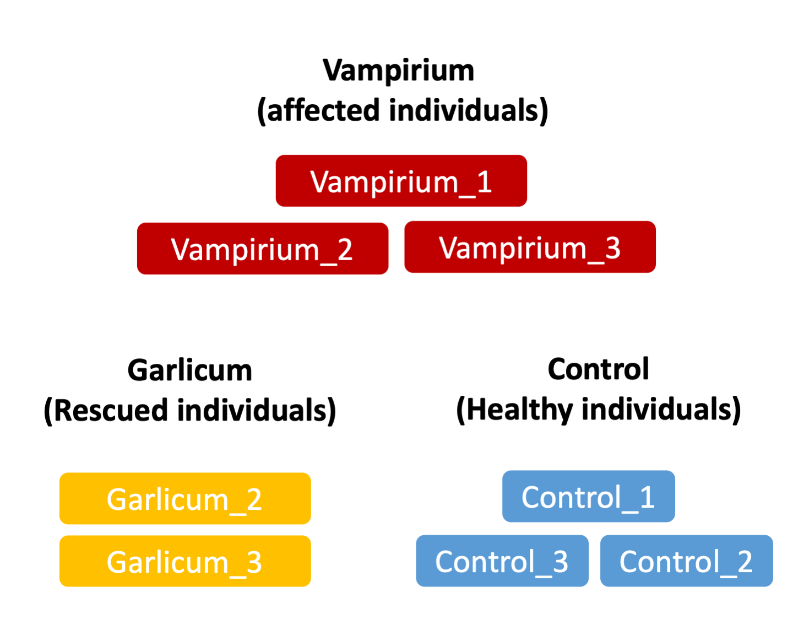

# Dataset explanation

**Last updated:** *{{ git_revision_date_localized }}*

!!! note "Section Overview"

    &#128368; **Time Estimation:** 5 minutes  

    &#128172; **Learning Objectives:**    

    1. Explain the experiment and its objectives.

We will be using the sequencing reads from the RNA-Seq dataset that is part of a larger study described in [Kenny PJ et al, Cell Rep 2014](http://www.ncbi.nlm.nih.gov/pubmed/25464849).

[GEO]: https://www.ncbi.nlm.nih.gov/geo/query/acc.cgi?acc=GSE51443 "Gene Expression Omnibus"
[SRA]: https://trace.ncbi.nlm.nih.gov/Traces/sra/?study=SRP031507 "Sequence Read Archive"

Nonetheless, we have decided to make the dataset and the study a bit more spicy. We have modified our gene annotation file so that we would get some interesting conditions and results! The story goes like this:

A mysterious condition named "Vampirium" is causing individuals to exhibit aggressive behavior and a strange desire for blood. Local individuals treat the symptoms using a concoction named "Garlicum", which seem to return the individuals to a normal status.

Scientists suspect that the condition might be related to changes in expression of genes related to blood production and impulse control. Thus, they have taken samples of individuals affected by Vampirum, individuals cured by the Garlicum concoction and healthy individuals used as control samples. With these samples, they have performed bulk RNAseq.

## Our questions

We will try to answer these questions:

* What patterns of expression can we identify between the Vampirium individuals and controls?
* What happens to the Vampirium individuals when treated with Garlicum?
* Are there any genes shared between the two comparisons?

***

*This lesson was originally developed by members of the teaching team (Mary Piper, Meeta Mistry, Radhika Khetani) at the [Harvard Chan Bioinformatics Core (HBC)](http://bioinformatics.sph.harvard.edu/).*
