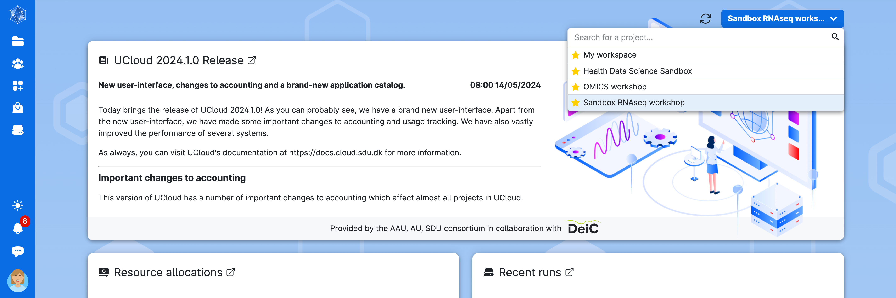
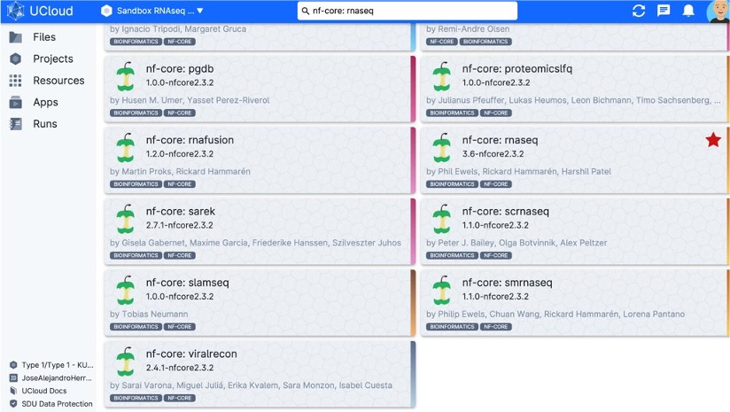
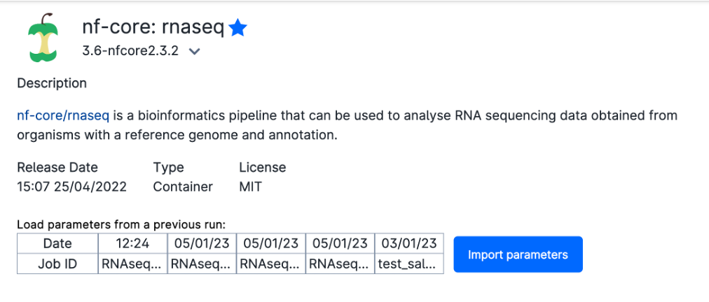
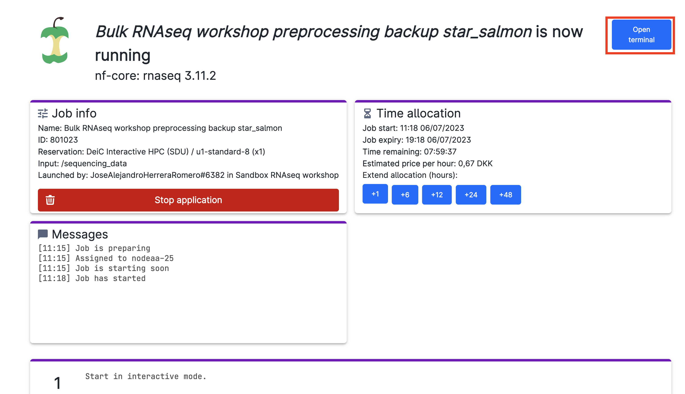
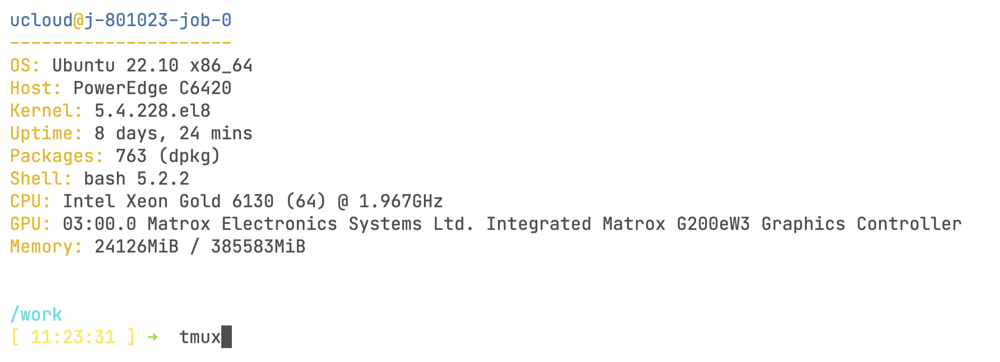
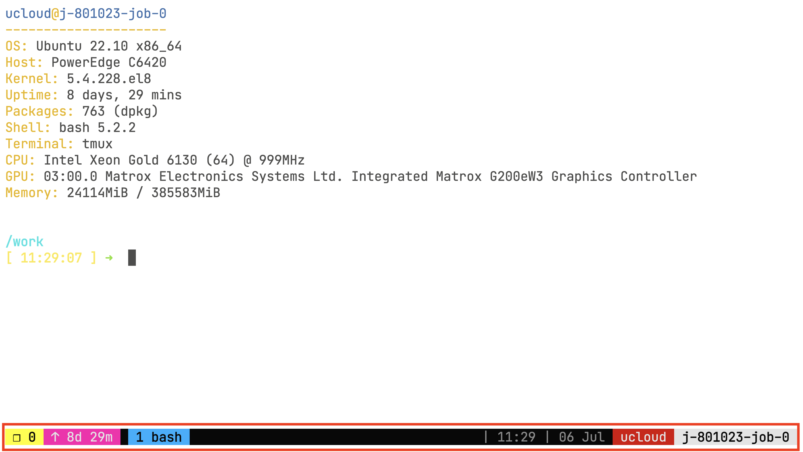
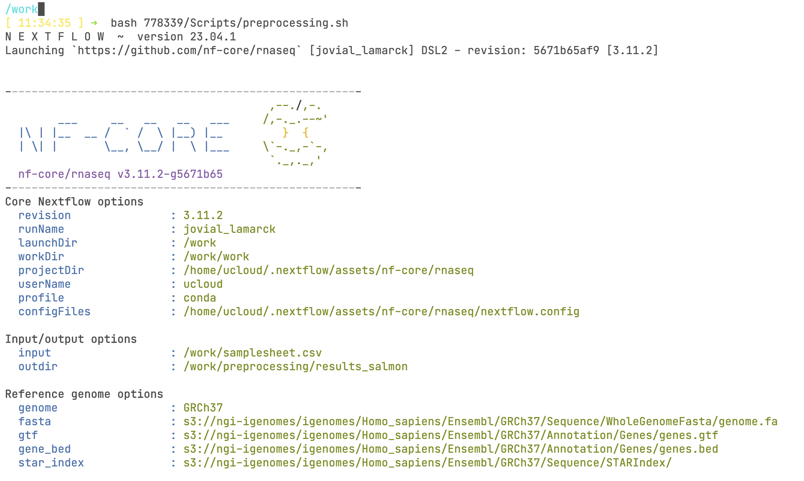
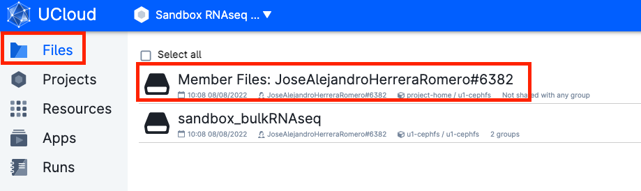

# Running the bulk RNAseq pipeline in uCloud

**Last updated:** *{{ git_revision_date_localized }}*

!!! note "Section Overview"

    &#128368; **Time Estimation:** X minutes  

    &#128172; **Learning Objectives:**    

    1. Learn about the UCloud computing system.
    2. Learn how to submit a job and explore your results folders.
    3. Submit a nf-core RNAseq run on our data

## Submit a job in Ucloud

Access [Ucloud](https://cloud.sdu.dk) with your account and choose the project `Sandbox RNASeq Workshop` where you have been invited. Or ask to be invited to <jose.romero@sund.ku.dk>.



Click on `Apps` on the left-side menu, and search for the application `nf-core rnaseq` and click on it.



You will be met with a series of possible parameters to choose. However, we have prepared the parameters already for you! Just click on `Import parameters`:



Then, `Import file from UCloud`:


And select the `jobParameters_preprocessing.json` in:

`sandbox_bulkRNASeq` -\> `sequencing_data` -\> `Scripts` -\> `ucloud_preprocessing_setup` -\> `jobParameters_preprocessing.json`

!!! warning
    **Make sure that the hard-drive icon says `sequencing_data`!!**

    Otherwise, click on the down arrow (**&or;**) icon and search for the folder.

    

You are ready to run the app! But first, take a look at the arguments used to run the job. We have given it a `Job name`, `Hours`, `Machine type` as well as an additional parameter `Interactive mode`. `Interactive mode` will allow us to follow the progress of the pipeline.


In addition, we have also selected the `sequencing_data` folder to have access to our sequencing reads in our job.


Now click on the button on the right column of the screen (`submit`) to start the job.

<p align="center">


</p>

Now, wait some time until the screen looks like the figure below. It usually takes a few minutes for everything to be ready. You can always come back to this screen from the left menu `Runs` on UCloud, so that you can add extra time or stop the app if you will not use it.



Now, click on `Open terminal` on the top right-hand side of the screen. You will start terminal session through your browser! Once inside the terminal, you will need to do one last thing before starting the pipeline:

```bash
tmux 
```



The `tmux` command will start a virtual command line session that is **recoverable**. This is very important because once we start the pipeline, we will lose the ability to track the progress if your computer loses connection or is in sleeping mode. You will know you are inside the tmux virtual session by looking at the bottom of the screen:



??? tip "Reconnect to tmux session"

    If you want to leave the tmux session, you can do so by pressing simultaneously `Ctrl` and `B` keys, and then press `D`. Then you can reconnect to the session using the command:

    ```bash
    tmux attach -t 0
    ```

We can finally start the run! Type in the command:

```bash
bash 778339/Scripts/preprocessing_salmon.sh
```


This will run a small bash script that will start the nf-core pipeline. It is usually a good idea to save the command that was used to run the pipeline! You should see now a prompt like this, which means that the pipeline started successfully!



Inside the `preprocessing_salmon.sh` script you will find:

```bash
cp /work/778339/raw_reads/samplesheet.csv /work/samplesheet.csv
cp /work/778339/Scripts/ucloud_preprocessing_setup/nf-params_salmon.json /work/nf-params_salmon.json
cd /work

nextflow run nf-core/rnaseq -r 3.11.2 -params-file /work/nf-params_salmon.json -profile conda --max_cpus 8 --max_memory 40GB

# Search for the last file created by the pipeline, the multiqc_report, recursively
file_path=$(find /work/preprocessing_results_salmon -name "multiqc_report.html" 2>/dev/null)

# Check if the file exists
if [[ -n "$file_path" ]]; then
    # Clean run if the pipeline is completed
    rm -r /work/work
    mv /work/nf-params_salmon.json /work/preprocessing_results_salmon/nf-params_salmon.json

fi
```

You see that we have copied the `samplesheet.csv` to the working directory `/work`. This is because the paths inside the `samplesheet.csv` for the fastq files of our samples are relative to the `/work` folder! **It is very important that the fastq paths inside this file matches properly to the paths inside your job!**

We have also copied the nf-params.json file with all the options used in the pipeline, so that you can find and replicate easily this run in the future. Finally, we remove the nextflow `work` directory if the pipeline completes successfully. this will save quite a bit if storage in the future, since the nextflow `work` directory will accumulate over runs.

Then we are making sure that we are inside the correct folder before starting the job using `cd /work`. We will see in the section below the arguments we used to run the pipeline:

## Understanding the pipeline options

Let's divide the command into different sections. First we have:

```
nextflow run nf-core/rnaseq -r 3.11.2
```

While usually one would run an nf-core pipeline using `nextflow run nf-core/rnaseq` and fetch the pipeline remotely, UCloud has installed the pipelines locally. Specifically, we are using the version 3.11.2 by using the argument `-r 3.11.2`.

***

Second, we have:

```
-params-file /work/778339/nf-params.json
```

The `-params-file` argument is another nextflow core argument that allows us to give the nf-core rnaseq pipeline arguments in a [json file](https://www.json.org/json-en.html), instead of creating an excessively long command. Writing the parameters this way allows for better reproducibility, since you can reuse the file in the future. Inside this file, we find the following arguments:

```json
{
    "input": "/work/samplesheet.csv",
    "outdir": "/work/preprocessing_results_salmon",
    "fasta": "/work/778339/genomic_resources/homo_sapiens/GRCh38/Homo_sapiens.GRCh38.dna_sm.primary_assembly.fa.gz",
    "gtf": "/work/778339/genomic_resources/homo_sapiens/GRCh38/Homo_sapiens.GRCh38.109.MODIFIED.gtf.gz",
    "pseudo_aligner": "salmon",
    "skip_stringtie": true,
    "skip_rseqc": true,
    "skip_preseq": true,
    "skip_qualimap": true,
    "skip_biotype_qc": true,
    "skip_bigwig": true,
    "skip_deseq2_qc": true,
    "skip_bbsplit": true,
    "skip_alignment": true,
    "extra_salmon_quant_args": "--gcBias"
}
```

**`--input` parameter**

The `--input` parameter points to the `samplesheet.csv` file that contains all the info regarding our samples. The file looks like this:

{{ read_csv('./assets/samplesheet.csv') }}

As you can see, we have also provided an extra column called `condition` specifying the sample type. This will be very useful for our Differential Expression Analysis. In addition, you can also notice that we have a single-end RNAseq experiment in our hands. Finally, take a note at the fastq paths that we have provided! They all point to where the files are located inside our job!

**`--outdir` parameter**

The `--outdir` parameter indicates where the results of the pipeline will be saved.

**`--fasta` parameter**

Path to FASTA reference genome file.

**`--gtf` parameter**

Path to GTF annotation file that contains genomic region information.

**`--pseudo_aligner` argument**

The `--pseudo_aligner` argument indicates that we want to use salmon to quantify transcription levels.

Finally, we are skipping several QC and extra steps that we did not explain in the [previous lesson](./04a_preprocessing.md). Do not worry if you cannot manage to run the pipeline or you do not have the time, we have prepared a backup folder that contains the results from a traditional alignment + pseudoquantification for you to freely explore! (More about that [below](#saved-results)).

***

We can continue with the next argument:

```
-profile conda
```

Unfortunately, the UCloud implementation of the nf-core pipelines do not currently allow the use of docker or singularity, which are the recommended profile options. However, UCloud has made sure that there is a working conda environment ready to use!

Then the last couple of arguments:

```
--max_cpus 8 --max_memory 40GB
```

These are nf-core specific arguments that indicates nextflow to only use as maximum the number of CPUs and RAM we have requested when we submitted the job. We are using 8 cores since it is what we requested in the submission page (e.g. if you submitted a job with 4 CPUs, this will be equal to 4). We are using slightly less RAM than we requested (48Gb) just in case there is a problem with memory overflow.

***

## Restarting a failed run

When running a nf-core pipelines for the first time, you might encounter some errors, for example, one of your files has an incorrect path, or a program failed to do its job.

!!! failure

    ```
    Error executing process >
    Caused by:
        Failed to create create conda environment
    ```


Once you fix the error, it is possible to *resume* a pipeline instead of restarting the whole workflow. You can do this by adding the `-resume` argument to the nextflow command:

```
nextflow run nf-core/rnaseq -r 3.11.2 -params-file /work/778339/Scripts/nf-params.json -profile conda --max_cpus 8 --max_memory 40GB​ -resume
```

## Stopping the app

Once the pipeline is done, go on `Runs` in uCloud and stop it from using more resources than necessary! This will help to keep the courses running for other people.


## Saved results

After finishing the job, everything that the pipeline has created will be saved in your own personal *"Jobs"* folder. Inside this folder there will be a subfolder called *nf-core: rnaseq*, which will contain all the jobs you have run with the nf-core app. Inside this folder, you will find the results folder named after the job name you gave when you submitted the job.

1. Your material will be saved in a volume with your username, that you should be able to see under the menu `Files`.



1. Go to `Jobs` -> `nf-core: rnaseq` -> `job_name` -> `preprocessing_results_salmon`


Now you have access to the full results of your pipeline! As explained in the [previous lesson](04b_pipelines.md), the nf-core rnaseq workflow will create a MultiQC report summarizing most of the steps into a single and beautiful html file that is interactive and explorable. In addition, there will be a folder with the results of the individual QC steps as well as the alignment and quantification results. Take your time and check it all out!
