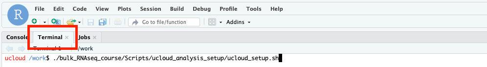

# Setup for teaching in uCloud

!!! note "Section Overview"

    &#128368; **Time Estimation:** X minutes  

    &#128172; **Learning Objectives:**    

    1. Start a transcriptomics app job in Ucloud for the next lessons in data analysis
    
## Submit the job in Ucloud

Access [Ucloud](https://cloud.sdu.dk) with your account and choose the project `Sandbox RNASeq Workshop` where you have been invited.

Click on `Apps` on the left-side menu, and search for the application `Transcriptomics Sandbox` and click on it.

You will be met with a series of possible parameters to choose. However, we have prepared the parameters already for you! Just click on `Import parameters`:

Then, `Import file from UCloud`:

And select the `jobParameters.json` in:

- `sandbox_bulkRNASeq` -\> `bulk_RNAseq_course` -\> `Scripts` -\> `ucloud_analysis_setup` -\> `jobParameters.json`

!!! warning 
    **Make sure that the hard-drive icon says `sandbox_bulkRNASeq`!!**
    

You are ready to run the app by clicking on the button on the right column of the screen (`submit`).

Now, wait some time until the screen looks like the figure below. It usually takes a few minutes for everything to be ready and installed. You can always come back to this screen from the left menu Runs on uCloud, so that you can add extra time or stop the app if you will not use it.

Now, click on `open interface` on the top right-hand side of the screen. You will start Rstudio through your browser!

On the lower right side of Rstudio, where you see the file explorer, there shoud be a folder `bulk_RNAseq_course`. Here you will find the materials of the course, but it is a "read only" file. In order to have a copy for your own purposes, we will use a script. Go to the **Terminal** tab on the top left of the Rstudio session and copy-paste this command:

`./bulk_RNAseq_course/Scripts/ucloud_analysis_setup/ucloud_setup.sh`

Now there should be another folder in the file explorer called `introduction_bulkRNAseq_analysis`. This is the folder you should use from now on.

Now you can go back to the **Console** tab. You are ready to start analysing your data!

## Stopping the app

When you are done, go on `Runs` in uCloud, and choose your app if it is still running. Then you will be able to stop it from using resources.

## Saved work

After running a first work session, everything that you have created, including the scripts and results of your analysis, will be saved in your own personal *"Jobs"* folder. Inside this folder there will be a subfolder called *Transcriptomics Sandbox*, which will contain all the jobs you have run with the Transcriptomics Sandbox app. Inside this folder, you will find your folder named after the job name you gave in the previous step.

1. Your material will be saved in a volume with your username, that you should be able to see under the menu `Files`. 

2. Go to `Jobs → Transcriptomics Sandbox → job_name → introduction_bulkRNAseq_analysis` 

 
## Restarting the Rstudio session

If you want to keep working on your previous results, you can restart an Rstudio session following these steps:

Click on `Apps` on the left-side menu, and look for the application `Transcriptomics Sandbox` and click on it.

You will be met again with a series of possible parameters to choose. You have to assign again the `Import parameters` file as before.

- `sandbox_bulkRNASeq` -\> `bulk_RNAseq_course` -\> `Scripts` -\> `ucloud_analysis_setup` -\> `jobParameters.json`

In *"Select folders to use"*, add the folder with the results of your previous job:

-   Go to `Member Files: your_username → Jobs → Transcriptomics Sandbox → job_name → introduction_bulkRNAseq_analysis`, click "Use."

You are ready to run the app by clicking on the button on the right column of the screen (`submit`). After opening the Rstudio interface, you should be able to access the folder `introduction_bulkRNAseq_analysis`, where you will find your course notebooks and results from your previous work!
