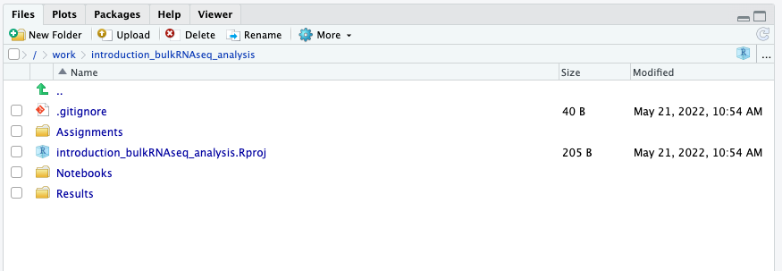

Approximate time: 20 minutes

## Learning Objectives

-   Describe how to set up an RNA-seq project in R
-   Describe the RNA-seq and the differential gene expression analysis
    workflow
-   Explain why negative binomial distribution is used to model RNA-seq
    count data

## Differential gene expression (DGE) analysis overview

The goal of RNA-seq is often to perform differential expression testing
to determine which genes are expressed at different levels between
conditions. These genes can offer biological insight into the processes
affected by the condition(s) of interest.

To determine the expression levels of genes, our RNA-seq workflow
followed the steps detailed in the image below. All steps were performed
on the command line (Linux/Unix) through the generation of the read
counts per gene. The differential expression analysis and any downstream
functional analysis are generally performed in R using R packages
specifically designed for the complex statistical analyses required to
determine whether genes are differentially expressed.


In the next few lessons, we will walk you through an **end-to-end
gene-level RNA-seq differential expression workflow** using various R
packages. We will start with the count matrix, do some exploratory data
analysis for quality assessment and explore the relationship between
samples. Next, we will perform differential expression analysis, and
visually explore the results prior to performing downstream functional
analysis.

## Setting up

Before we get into the details of the analysis, let’s get started by
opening up RStudio and setting up a new project for this analysis.

1.  Go to the `File` menu and select `New Project`.
2.  In the `New Project` window, choose `Existing Directory`. Then,
    choose `introduction_bulkRNAseq_analysis` as your project working
    directory.
3.  The new project should automatically open in RStudio.

To check whether or not you are in the correct working directory, use
`getwd()`. The path `/work/introduction_bulkRNAseq_analysis` should be
returned to you in the console. When finished your working directory
should now look similar to this:



-   Inside the folder `Notebooks` you will find the scripts (in `Rmd`
    format) that we will follow during the sessions.

-   In the folder `Results` you will save the results of your scripts,
    analysis and tests.

To avoid copying the original dataset for each student (very
inefficient) the dataset is contained inside the shared folder
`/work/introduction_bulkRNAseq_analysis/Data/`. Do not attempt to modify
this folder, as it might mess up the files for the rest of your
colleagues.

Now you can open the first practical session: `06a_count_matrix.Rmd`

### Loading libraries

For this analysis we will be using several R packages, some which have
been installed from CRAN and others from Bioconductor. To use these
packages (and the functions contained within them), we need to **load
the libraries.** Add the following to your script and don’t forget to
comment liberally!

``` r
## Setup
### Bioconductor and CRAN libraries used
library(tidyverse)
library(RColorBrewer)
library(DESeq2)
library(pheatmap)
library(DEGreport)
library(ggrepel)
```

### Loading data

To load the data into our current environment, we will be using the
`read.table` function. By default the function expects tab-delimited
files, which is what we have.

``` r
## Load in data
data <- read_table("/work/introduction_bulkRNAseq_analysis/Data/Mov10_full_counts.txt") 

meta <- read_table("/work/introduction_bulkRNAseq_analysis/Data/Mov10_full_meta.txt")
```

Use `class()` to inspect our data and make sure we are working with data
frames:

``` r
### Check classes of the data we just brought in
class(meta)
class(data)
```

### Viewing data

Make sure your datasets contain the expected samples / information
before proceeding to perfom any type of analysis.

``` r
View(meta)
View(data)
```

> ### Using the abundance estimates from Salmon as input to DESeq2
>
> The counts used in these lessons were generated using the standard
> approach for RNA-seq analysis, where samples were aligned to the
> genome using a splice-aware aligner followed by counting. If you are
> using lightweight algorithms such as Salmon, Sailfish or Kallisto to
> generate abundance estimates, you can also use DESeq2 to perform
> gene-level differential expression analysis. These transcript
> abundance estimates, often referred to as ‘pseudocounts’, can be
> converted for use with DESeq2 but the setup is slightly more involved.
> If you are interested in knowing more about using Salmon pseudocounts
> for DESeq2, there are [materials linked
> here](https://hbctraining.github.io/DGE_workshop_salmon/lessons/01_DGE_setup_and_overview.html).

## Differential gene expression analysis overview

So, what does this count data actually represent? The count data used
for differential expression analysis represents the number of sequence
reads that originated from a particular gene. The higher the number of
counts, the more reads associated with that gene, and the assumption
that there was a higher level of expression of that gene in the sample.


With differential expression analysis, we are looking for genes that
change in expression between two or more groups (defined in the
metadata) - case vs. control - correlation of expression with some
variable or clinical outcome

**Why does it not work to identify differentially expressed gene by
ranking the genes by how different they are between the two groups
(based on fold change values)?**


Genes that vary in expression level between groups of samples may do so
solely as a consequence of the biological variable(s) of interest.
However, this difference is often also related to extraneous effects, in
fact, sometimes these effects exclusively account for the observed
variation. The goal of differential expression analysis to determine the
relative role of these effects, hence separating the “interesting”
variance from the “uninteresting” variance.


Although the mean expression levels between sample groups may appear to
be quite different, it is possible that the difference is not actually
significant. This is illustrated for ‘GeneA’ expression between
‘untreated’ and ‘treated’ groups in the figure below. The mean
expression level of geneA for the ‘treated’ group is twice as large as
for the ‘untreated’ group, but the variation between replicates
indicates that this may not be a significant difference. **We need to
take into account the variation in the data (and where it might be
coming from) when determining whether genes are differentially
expressed.**


Differential expression analysis is used to determine, for each gene,
whether the differences in expression (counts) **between groups** is
significant given the amount of variation observed **within groups**
(replicates). To test for significance, we need an appropriate
statistical model that accurately performs normalization (to account for
differences in sequencing depth, etc.) and variance modeling (to account
for few numbers of replicates and large dynamic expression range).

### RNA-seq count distribution

To determine the appropriate statistical model, we need information
about the distribution of counts. To get an idea about how RNA-seq
counts are distributed, let’s plot the counts of all the samples:

``` r
pdata <- data %>% 
  gather(key = Sample, value = Count, -GeneSymbol)

pdata

ggplot(pdata) +
  geom_histogram(aes(x = Count), stat = "bin", bins = 200) +
  xlab("Raw expression counts") +
  ylab("Number of genes")
```


If we zoom in close to zero, we can see a large number of genes with
counts of zero:

``` r
ggplot(pdata) +
   geom_histogram(aes(x = Count), stat = "bin", bins = 200) + 
   xlim(-5, 500)  +
   xlab("Raw expression counts") +
   ylab("Number of genes")
```


These images illustrate some common features of RNA-seq count data,
including a **low number of counts associated with a large proportion of
genes**, and a long right tail due to the **lack of any upper limit for
expression**. Unlike microarray data, which has a dynamic range maximum
limited due to when the probes max out, there is no limit of maximum
expression for RNA-seq data. Due to the differences in these
technologies, the statistical models used to fit the data are different
between the two methods.

> **NOTE:** The log intensities of the microarray data approximate a
> normal distribution. However, due to the different properties of the
> of RNA-seq count data, such as integer counts instead of continuous
> measurements and non-normally distributed data, the normal
> distribution does not accurately model RNA-seq counts
> \[[1](https://www.ncbi.nlm.nih.gov/pmc/articles/PMC3541212/)\].

### Modeling count data

RNAseq count data can be modeled using a **Poisson distribution**. this
particular distribution is fitting for data where the **number of cases
is very large but the probability of an event occurring is very small**.
To give you an example, think of the lottery: many people buy lottery
tickets (high number of cases), but only very few win (the probability
of the event is small). [Check this video from Rafael Irizarry in the
EdX class for more details](https://youtu.be/fxtB8c3u6l8).

With RNA-Seq data, **a very large number of RNAs are represented and the
probability of pulling out a particular transcript is very small**.
Thus, it would be an appropriate situation to use the Poisson
distribution. However, a unique property of this distribution is that
the mean == variance. Realistically, with RNA-Seq data there is always
some biological variation present across the replicates (within a sample
class). Genes with larger average expression levels will tend to have
larger observed variances across replicates.

The model that fits best, given this type of variability observed for
replicates, is the **Negative Binomial (NB) model**. Essentially, **the
NB model is a good approximation for data where the mean \< variance**,
as is the case with RNA-Seq count data.


> **NOTE:**
>
> -   **Biological replicates** represent multiple samples (i.e. RNA
>     from different mice) representing the same sample class
> -   **Technical replicates** represent the same sample (i.e. RNA from
>     the same mouse) but with technical steps replicated
> -   Usually biological variance is much greater than technical
>     variance, so we do not need to account for technical variance to
>     identify biological differences in expression
> -   **Don’t spend money on technical replicates - biological
>     replicates are much more useful**

> **NOTE:** If you are using **cell lines** and are unsure whether or
> not you have prepared biological or technical replicates, take a look
> at [this
> link](https://web.archive.org/web/20170807192514/http://www.labstats.net:80/articles/cell_culture_n.html).
> This is a useful resource in helping you determine how best to set up
> your *in-vitro* experiment.

<details>
<summary>

**How do I know if my data should be modeled using the Poisson
distribution or Negative Binomial distribution??**

</summary>

If it’s count data, it should fit the negative binomial, as discussed
previously. However, it can be helpful to plot the *mean versus the
variance* of your data. *Remember for the Poisson model, mean =
variance, but for NB, mean \< variance.*

Run the following code to plot the *mean versus variance* for our data:

``` r
df <- data %>% 
  rowwise() %>% 
  summarise(mean_counts = mean(Mov10_kd_2:Irrel_kd_3), 
            variance_counts = var(Mov10_kd_2:Irrel_kd_3))


ggplot(df) +
  geom_point(aes(x=mean_counts, y=variance_counts)) + 
  geom_abline(intercept = 0, slope = 1, color="red") +
  scale_y_log10() +
  scale_x_log10()
```


Note that in the above figure, the variance across replicates tends to
be greater than the mean (red line), especially for genes with large
mean expression levels. *This is a good indication that our data do not
fit the Poisson distribution and we need to account for this increase in
variance using the Negative Binomial model (i.e. Poisson will
underestimate variability leading to an increase in false positive DE
genes).*

</details>

### Improving mean estimates (i.e. reducing variance) with biological replicates

The variance or scatter tends to reduce as we increase the number of
biological replicates (*the distribution will approach the Poisson
distribution with increasing numbers of replicates*), since standard
deviations of averages are smaller than standard deviations of
individual observations. **The value of additional replicates is that as
you add more data (replicates), you get increasingly precise estimates
of group means, and ultimately greater confidence in the ability to
distinguish differences between sample classes (i.e. more DE genes).**

The figure below illustrates the relationship between sequencing depth
and number of replicates on the number of differentially expressed genes
identified (from [Liu et
al. (2013)](https://doi.org/10.1093/bioinformatics/btt688):


Note that an **increase in the number of replicates tends to return more
DE genes than increasing the sequencing depth**. Therefore, generally
more replicates are better than higher sequencing depth, with the caveat
that higher depth is required for detection of lowly expressed DE genes
and for performing isoform-level differential expression. Generally, the
minimum sequencing depth recommended is 20-30 million reads per sample,
but we have seen good RNA-seq experiments with 10 million reads if there
are a good number of replicates.


### Differential expression analysis workflow

To model counts appropriately when performing a differential expression
analysis, there are a number of software packages that have been
developed for differential expression analysis of RNA-seq data. Even as
new methods are continuously being developed a few tools are generally
recommended as best practice, like
[**DESeq2**](https://bioconductor.org/packages/release/bioc/html/DESeq2.html),
[**EdgeR**](https://bioconductor.org/packages/release/bioc/html/edgeR.html)
and
[**Limma-Voom**](https://genomebiology.biomedcentral.com/articles/10.1186/gb-2014-15-2-r29).

Many studies describing comparisons between these methods show that
while there is some agreement, there is also much variability between
tools. **Additionally, there is no one method that performs optimally
under all conditions** **([Soneson and Dleorenzi,
2013](https://bmcbioinformatics.biomedcentral.com/articles/10.1186/1471-2105-14-91),
[Corchete et al,
2020](https://www.nature.com/articles/s41598-020-76881-x))**.


**We will be using
[DESeq2](https://genomebiology.biomedcentral.com/articles/10.1186/s13059-014-0550-8)
for the DE analysis, and the analysis steps with DESeq2 are shown in the
flowchart below in green**. DESeq2 first normalizes the count data to
account for differences in library sizes and RNA composition between
samples. Then, we will use the normalized counts to make some plots for
QC at the gene and sample level. The final step is to use the
appropriate functions from the DESeq2 package to perform the
differential expression analysis.


We will go in-depth into each of these steps in the following lessons,
but additional details and helpful suggestions regarding DESeq2 can be
found in the [DESeq2
vignette](http://bioconductor.org/packages/devel/bioc/vignettes/DESeq2/inst/doc/DESeq2.html).
As you go through this workflow and questions arise, you can reference
the vignette from within RStudio:

    vignette("DESeq2")

This is very convenient, as it provides a wealth of information at your
fingertips! Be sure to use this as you need during the workshop.

------------------------------------------------------------------------

*This lesson was originally developed by members of the teaching team
(Mary Piper, Meeta Mistry, Radhika Khetani) at the [Harvard Chan
Bioinformatics Core (HBC)](http://bioinformatics.sph.harvard.edu/).*
