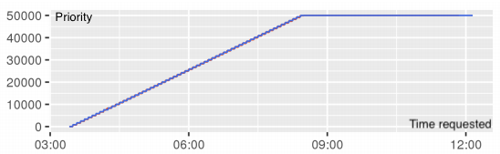

# Best practices for HPC

This page lists some useful best practices to keep in mind when coding and running applications and pipelines on an HPC.

## Code coverage, testing, continuous integration
Every time we code, testing is a concern and is usually performed by the coder(s) regularly during the project. One can identify some basic main types of test:

=== "Regression test"

    *Given an expected output from a specific input, the code is tested to reproduce that same output.*

=== "Unit test"

    *Tests the smallest units of the software (e.g. single functions) to identify bugs, especially in extreme cases of inputs and outputs*

=== "Continuous integration"

    *A set of tests for the software runs automatically everytime the software code is updated. This is useful to spot bugs before someone even uses the code.*

More things one might need to test are the performance/scalability of the code, usability, response to all the intended types of input data.

Unit and regression test can be useful, but at some point not really feasible, since the code can scale to be quite large and complex, with a lot of things to control. 
It is thus a good practice to use continuous integration, and implement simple but representative tests that cover all the code, so that bugs can be spotted often before the final users do that.
Code coverage tools to implement such tests exists for several programming languages, and also for testing code deployed on Github version control.

??? Links

    | Link      | Description                          |
    | :---------- | :----------------------------------- |
    | [pyTest](https://pytest.org/)       | a package to test `python` code  |
    | [Cmake](https://cmake.org/Wiki/CMake/Testing_With_CTest)      | to test both `C`, `C++` and `Fortran code` |
    | [Travis CI](https://www.travis-ci.com/)      | tool for continuous integration in most of the used programming languages. Works on Git version control. |
    | [covr](https://github.com/r-lib/covr)      | test coverage reports for R |

## Code styling
An important feature of a computer code is that it is understandable by other people reading it. To make this happen, a clean and coherent style of coding should be used in a project. Some languages have a preferred coding style, and in some GUI those styling rules can be set to be required. One can also use its own coding style, but it should be one easily readable by others, and it should be the same style over the whole project.

??? Links

    | Link      | Description                          |
    | :---------- | :----------------------------------- |
    | [styleguide](https://google.github.io/styleguide/)       | Google guide for coding styles of the major programming languages  |
    | [awesome guidelines](https://kristories.gitbook.io/awesome-guidelines/)      | A guide to coding styles covering also documentations, tools and development environments |
    | [Pythonic rules](https://docs.python-guide.org/writing/style/)      | Intoduction to coding style in python. |
    | [R style](https://www.r-bloggers.com/2019/01/%F0%9F%96%8A-r-coding-style-guide/)      | A post on R coding style |

## Containerized applications
In this page we show the benefits of project and package managers, that are a way of organizing packages in separated environments. However, a higher degree of isolation than environments can be achieved by containerization. By containerizing, a user can virtualize the entire operating system, and make it ready to be deployed on any other machine. One can for example deploy a container without the need of installing anything on the hosting machine! Note that containers are a different concept from Virtual Machines, where it is the hardware being instead virtualized. 

??? Links

    | Link      | Description                          |
    | :---------- | :----------------------------------- |
    | [Docker](https://www.docker.com/why-docker) | An open source widespread container that is popular both in research and industry |
    | [Docker course](https://www.youtube.com/watch?v=fqMOX6JJhGo)      | A course to use Docker, freely hosted on youtube |
    | [Docker curriculum](https://docker-curriculum.com/)      | Beginner introduction to docker |
    | [Docker basics](https://docs.docker.com/get-started/)      | Intoduction tutorials to Docker from the official documentation page |
    | [Singularity](https://sylabs.io/) | Singularity is another containerization tool. It allows you to decide at which degree a container interacts with the hosting system |
    | [Singularity tutorial](https://singularity-tutorial.github.io/) | A well done Singularity tutorial for HPC users|
    | [Singularity video tutorial](https://www.youtube.com/watch?v=Gowh5pfzOAM) | A video tutorial on Singularity |
    | [Reproducibility by containerization](https://www.youtube.com/watch?v=DA87Ba2dpNM) | A video on reproducibility with Singularity containers |

## Documentation
When creating a piece of software, it is always a good idea to create a documentation explaining the usage of each element of the code. For packages, there are softwares that create automatically a documentation by using functions´ declarations and eventually some text included into them as a string. 

??? Links

    | Link      | Description                          |
    | :---------- | :----------------------------------- |
    | [MkDocs](https://www.mkdocs.org/) | A generator for static webpages, with design and themes targeted to documentation pages, but also other type of websites. This website is itself made with MkDocs. |
    | [mkdocstrings](https://github.com/pawamoy/mkdocstrings) | Python handler to automatically generate documentation with MkDocs |
    | [pdoc3](https://pdoc3.github.io/pdoc/)      | A package who creates automatically the documentation for your coding projects. It is semi automatic (infers your dependencies, classes, ... but adds a description based on your docstrings) |
    | [pdoc3 101](https://www.scivision.dev/pdoc-python-quickstart/)      | How to run pdoc to create an html documentation |
    | [Roxygen2](https://cran.r-project.org/web/packages/roxygen2/vignettes/roxygen2.html) | A package to generate `R` documentation - it can be used also with `Rcpp` |
    | [Sphinx](https://www.sphinx-doc.org/en/master/) | Another tool to write documentation - it produces also printable outputs. `Sphinx` was first created to write the `python` language documentation. Even though it is a tool especially thought for `python` code, it can be used to generate static webpages for other projects.|

## Documents with live code
Programming languages like `python` and `R` allows users to write documents that contain text, images and equations together with executable code and its output. Text is usually written using the very immediate markdown `language`. Markdown files for `R` can be created in the GUI `Rstudio`, while `python` uses `jupyter notebooks`.

??? Links

    | Link      | Description                          |
    | :---------- | :----------------------------------- |
    | [Introduction to Markdown](https://rmarkdown.rstudio.com/articles_intro.html)       | Markdown for `R` in `Rstudio`  |
    | [Jupyter notebooks](https://jupyter.org/)       | create interactive code with `python`. You can write `R` code in a jupyter notebook by using the `python` package [rpy2](https://rpy2.github.io/doc/latest/html/index.html)  |

## Package/Environment management systems
When coding, it is essential that all the projects are developed under specific software conditions, i.e. the packages and libraries used during development (dependencies) should not change along the project's lifetime, so that variations in things such as output formats and new algorithmic implementations will not create conflicts difficult to trace back under development. An environment and package manager makes the user able to create separated frameworks (environments) where to install specific packages that will not influence other softwares outside the environment in use. A higher degree of isolation can be achieved through containers (see the related voice in this page).

??? Links

    | Link      | Description                          |
    | :---------- | :----------------------------------- |
    | [Conda](https://docs.conda.io/en/latest/) | an easy to use and very popular environment manager  |
    | [Getting started with conda](https://docs.conda.io/projects/conda/en/latest/user-guide/getting-started.html) | Introduction to `conda` setup and usage from the official documentation |
    | [Conda cheat sheet](https://docs.conda.io/projects/conda/en/latest/user-guide/cheatsheet.html) | Quick reference for `conda` usage  |
    | [YARN](https://yarnpkg.com/) | An alternative to `conda` |

## Many short jobs running
Everytime a job is submitted to the job manager (e.g. SLURM) of a computing cluster, there is an overhead time necessary to elaborate resource provision, preparation for output, and queue organization. Therefore it is wise to create, when possible, longer jobs. One needs to find the correct balance for how to organizing jobs: if these are too long and fail because of some issue, than a lot of time and resources have been wasted, but such problem can be overcome by tracking the outputs of each step to avoid rerunning all computations. For example, at each step of a job outputting something relevant, there can be a condition checking if the specific output is already present.

## Massive STDOUT outputs
Try to avoid printing many outputs on the standard output `STDOUT`, in other words a large amount of printed outputs directly to the terminal screen. This can be problematic when a lot of parallel jobs are running, letting `STDOUT` filling all the home directory up, and causing errors and eventual data loss. Use instead an output in software-specific data structures (such as `.RData` files for the `R` language) or at least simple text files.

## Packaging a coding project
When coding a piece of software in which there are multiple newly implemented function, it can be smart to organize all those functions as a package, that can be reused and eventually shared with ease. Such a practice is especially easy and can be mastered very quickly for coding projects in `python` and `R`.

??? Links

    | Link      | Description                          |
    | :---------- | :----------------------------------- |
    | [pyPA](https://packaging.python.org/tutorials/packaging-projects/) | `python` packaging user guide  |
    | [R package development](https://support.rstudio.com/hc/en-us/articles/200486488-Developing-Packages-with-RStudio)       | Develop an `R` package using `Rstudio`  |

## Pipelining and submitting jobs in SLURM 

[SLURM](https://slurm.schedmd.com/) is a job scheduler. It allows a user to specify a series of commands and resources requirements to run such commands. Slurm does consider the job submission on an HPC system together with all the other jobs, and prioritize them according to the resources requirement and the available computational power.

In figure above, the priority assigned to a SLURM job when the requested time increases, by keeping the memory and CPUs fixed. Decreased priority has higher values. Adapted from *A	Slurm	Simulator: Implementation	and	Parametric Analysis. Simakov et al 2017.*

 The danish national HPCs, and most of the other EuroHPC supercomputers, use Slurm as job manager. 

??? Links

    | Link      | Description                          |
    | :---------- | :----------------------------------- |
    | [SLURM example 1](https://genome.au.dk/docs/interacting-with-the-queue/ ) and [SLURM example 2](https://researchcomputing.princeton.edu/slurm )| Some examples of how to make a Slurm script to submit a job from the danish HPC GenomeDK and from Princeton Research Computing. |
    | [Gwf, a simple python tool to create interdependent job submissions](https://gwf.app/ )       | Gwf, developed at the University of Aarhus, makes it easy to create Slurm jobs and organize them as a pipeline with dependencies, using the python language (you need python 3.5+). You get to simply create the shell scripts and the dependencies, without the complicating syntax of Slurm. The page contains also a useful guide. |

## Version control
Version control is the tracking of your development history for a project. This allows multiple people working on the same material to keep changes in sync without stepping over each other's contributions. Version control tools allow to commit changes with a description, set up and assign project objectives, open software issues from users and contributors, test automatically the code to find bugs before users step into them. Version control is useful for both teams and single users, and it is a good practice to have version control as a standard for any project.

??? Links

    | Link      | Description                          |
    | :---------- | :----------------------------------- |
    | [GitHub](https://www.github.com) | the most used tool for version control  |
    | [Github 101](https://lab.github.com/githubtraining/introduction-to-github) | quick introduction to get started on Github  |
    | [GitLab](https://about.gitlab.com/) and [BitBucket](https://bitbucket.org/) | Two other popular alternatives to `Github`  |

