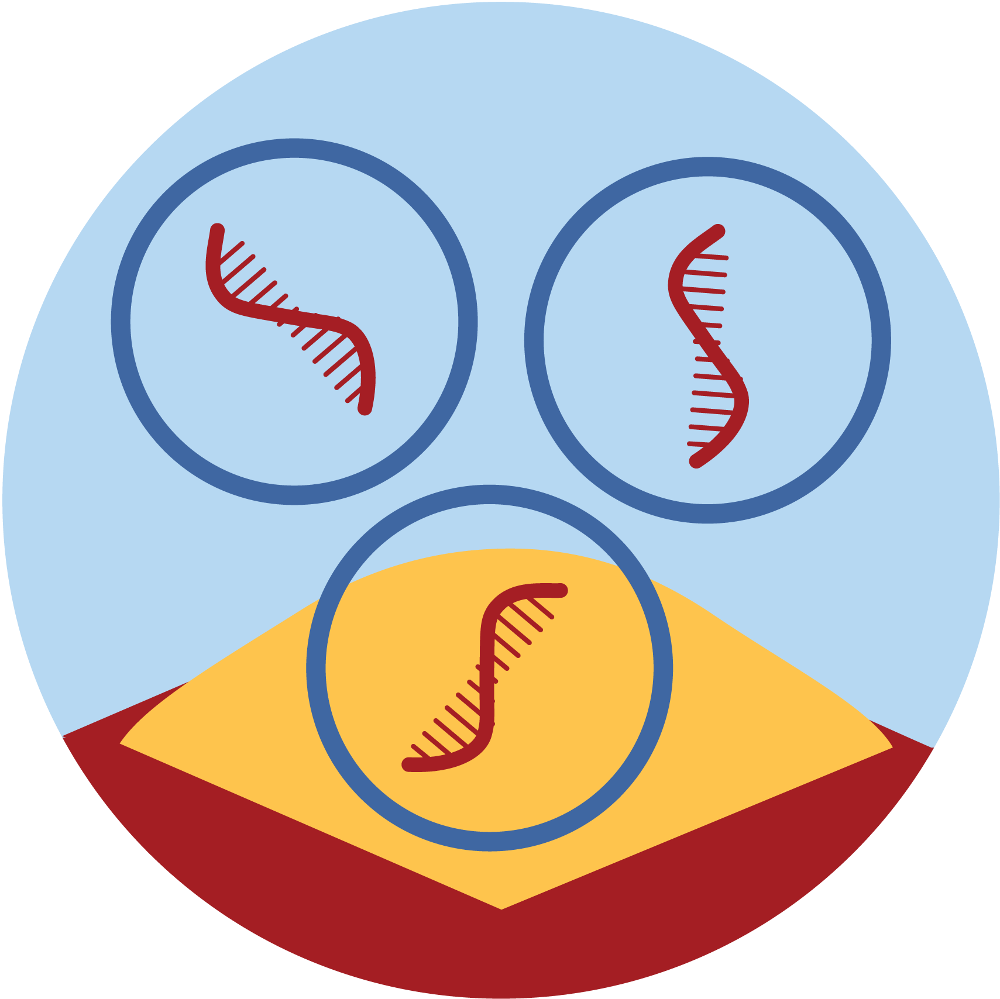

:::{.hero-banner}
# Welcome to the bulk RNAseq workshop 
:::

:::{.callout-warning title="Required preparation"}
You are expected to make sure you can sign in to UCloud, SDU's HPC platform on which we will be running this course. All data, assignments, and tools will be provided on UCloud. Please use your university ID to sign in (instructions below). If you run into problems, please write us (respond to the email that got you to this page).

:::

## Access Sandbox resources

Our first choice is to provide all the **training materials, tutorials, and tools as interactive apps on UCloud**, the supercomputer located at the University of Southern Denmark. Anyone using these resources needs the following:

 1. a Danish university ID so you can sign on to UCloud via WAYF^[Other institutions (e.g. hospitals, libraries, ...) can log on through WAYF. See all institutions [here](https://www.wayf.dk/da/institutioner-i-wayf)]. 

&nbsp;

 

  <a href="https://cloud.sdu.dk" style="background-color: #4266A1; color: #FFFFFF; padding: 30px 20px; text-decoration: none; border-radius: 5px;">
    for UCloud Access
    click here
  </a>

&nbsp;

 2. basic ability to navigate in Linux/RStudio/Jupyter. **You don't need to be an expert**, but it is beyond our ambitions (and course material) to teach you how to code from zero and how to run analyses simultaneously. We recommend a basic R or Python course before diving in.

 3. **For workshop participants:** Use our invite link to the correct UCloud workspace that will be shared on the day of the workshop. This way, we can provide you with compute resources for the active sessions of the workshop^[To use Sandbox materials outside of the workshop: remember that each new user has hundreds of hours of free computing credit and around 50GB of free storage, which can be used to run any uCloud software. If you run out of credit (which takes a long time) you'll need to check with the [local DeiC office at your university](https://www.deic.dk/en/Front-Office) about how to request compute hours on UCloud. Contact us at the Sandbox if you need help or want more information.] Click the link below after your first uCloud access and accept the invite that shows.

 &nbsp;

 

  <a href="https://cloud.sdu.dk/app/projects/invite/3a8e1744-7382-4621-8c4b-f15358a9a5a8" style="background-color: #4266A1; color: #FFFFFF; padding: 30px 20px; text-decoration: none; border-radius: 5px;">
    Invite link to
    uCloud workspace
  </a>

&nbsp;

4. Additional files needed for exercises from Day 1 - Lecture 2 (QC report files)

  <a href="./QC_exercise_files_1124.zip" download="qcreport-files.zip">
    <button class="btn-action">Download QC files</button>
  </a>

<!-- 
5. Course slides

  <a href="./BulkRNAseq_slides_nov24.zip" download="bulkRNAseq-slides.zip">
    <button class="btn-action">Download course slides</button>
  </a>

&nbsp;

6. COURSE EVALUATION SURVEY - The Novo Nordisk Foundation funds the Sandbox project and is interested in the outcomes of our training activities, so we really appreciate your responses!

 &nbsp;

  <a href="https://forms.office.com/e/Hapv2e03aM" 
  style="background-color: #4266A1; color: #FFFFFF; padding: 30px 20px; text-decoration: none; border-radius: 5px;">
    Evaluation survey link
  </a>

&nbsp;
-->

# Workshop Agenda

::: {.agenda-legend}
[Lecture]{.agenda-tag .lecture} [Exercise]{.agenda-tag .exercise} [Discussion]{.agenda-tag .qa} [Break]{.agenda-tag .break}
:::

::: {.panel-tabset}

## Day 1

::: {.agenda}

::: {.agenda-item .lecture}
[9:00]{.agenda-time} [Intro to course]{.agenda-title} [Lecture]{.agenda-tag .lecture}
:::

::: {.agenda-item .lecture}
[9:15]{.agenda-time} [Experimental design]{.agenda-title} [Lecture]{.agenda-tag .lecture}
:::

::: {.agenda-item .lecture}
[9:45]{.agenda-time} [Preprocessing and library prep]{.agenda-title} [Lecture]{.agenda-tag .lecture}
:::

::: {.agenda-item .break}
[10:15]{.agenda-time} [Coffee break]{.agenda-title}
:::

::: {.agenda-item .lecture}
[10:30]{.agenda-time} [Trimming, QC, and alignment]{.agenda-title} [Lecture]{.agenda-tag .lecture}
:::

::: {.agenda-item .lecture}
[11:30]{.agenda-time} [Feature counts and MultiQC]{.agenda-title} [Lecture]{.agenda-tag .lecture}
:::

::: {.agenda-item .break}
[12:00]{.agenda-time} [Lunch break]{.agenda-title}
:::

::: {.agenda-item .exercise}
[13:00]{.agenda-time} [Feature counts, MultiQC, and alignment]{.agenda-title} [Exercise]{.agenda-tag .exercise}
:::

::: {.agenda-item .lecture}
[13:45]{.agenda-time} [Intro to HPC and UCloud]{.agenda-title} [Lecture]{.agenda-tag .lecture}
:::

::: {.agenda-item .break}
[14:30]{.agenda-time} [Coffee break]{.agenda-title}
:::

::: {.agenda-item .exercise}
[15:00]{.agenda-time} [Nextflow pipelines, nf-core, and UCloud]{.agenda-title} [Exercise]{.agenda-tag .exercise}
:::

::: {.agenda-item .lecture}
[16:00]{.agenda-time} [RNAseq results from pipeline]{.agenda-title} [Lecture]{.agenda-tag .lecture}
:::

::: {.agenda-item .qa}
[16:30]{.agenda-time} [Q & A]{.agenda-title} [Discussion]{.agenda-tag .qa}
:::

:::

## Day 2

::: {.agenda}

::: {.agenda-item .lecture}
[9:00]{.agenda-time} [UCloud setup / recap]{.agenda-title} [Lecture]{.agenda-tag .lecture}
:::

::: {.agenda-item .lecture}
[9:30]{.agenda-time} [RNAseq count matrix and normalization]{.agenda-title} [Lecture]{.agenda-tag .lecture}
:::

::: {.agenda-item .break}
[10:15]{.agenda-time} [Coffee break]{.agenda-title}
:::

::: {.agenda-item .exercise}
[10:30]{.agenda-time} [Count matrices]{.agenda-title} [Exercise]{.agenda-tag .exercise}
:::

::: {.agenda-item .lecture}
[11:30]{.agenda-time} [Exploratory data analysis]{.agenda-title} [Lecture]{.agenda-tag .lecture}
:::

::: {.agenda-item .break}
[12:00]{.agenda-time} [Lunch break]{.agenda-title}
:::

::: {.agenda-item .exercise}
[13:00]{.agenda-time} [Exploratory data analysis]{.agenda-title} [Exercise]{.agenda-tag .exercise}
:::

::: {.agenda-item .break}
[14:30]{.agenda-time} [Coffee break]{.agenda-title}
:::

::: {.agenda-item .lecture}
[14:45]{.agenda-time} [Differential expression analysis]{.agenda-title} [Lecture]{.agenda-tag .lecture}
:::

::: {.agenda-item .qa}
[16:30]{.agenda-time} [Q & A]{.agenda-title} [Discussion]{.agenda-tag .qa}
:::

:::

## Day 3

::: {.agenda}

::: {.agenda-item .lecture}
[9:00]{.agenda-time} [UCloud setup / recap]{.agenda-title} [Lecture]{.agenda-tag .lecture}
:::

::: {.agenda-item .lecture}
[9:45]{.agenda-time} [DEA visualization]{.agenda-title} [Lecture]{.agenda-tag .lecture}
:::

::: {.agenda-item .break}
[10:30]{.agenda-time} [Coffee break]{.agenda-title}
:::

::: {.agenda-item .lecture}
[10:45]{.agenda-time} [Gene annotation and databases]{.agenda-title} [Lecture]{.agenda-tag .lecture}
:::

::: {.agenda-item .exercise}
[11:15]{.agenda-time} [Gene annotation]{.agenda-title} [Exercise]{.agenda-tag .exercise}
:::

::: {.agenda-item .break}
[12:00]{.agenda-time} [Lunch break]{.agenda-title}
:::

::: {.agenda-item .exercise}
[13:00]{.agenda-time} [Gene annotation]{.agenda-title} [Exercise]{.agenda-tag .exercise}
:::

::: {.agenda-item .lecture}
[13:30]{.agenda-time} [Functional analysis]{.agenda-title} [Lecture]{.agenda-tag .lecture}
:::

::: {.agenda-item .break}
[14:15]{.agenda-time} [Coffee break]{.agenda-title}
:::

::: {.agenda-item .exercise}
[14:30]{.agenda-time} [Functional analysis]{.agenda-title} [Exercise]{.agenda-tag .exercise}
:::

::: {.agenda-item .lecture}
[15:15]{.agenda-time} [Workflow summary]{.agenda-title} [Lecture]{.agenda-tag .lecture}
:::

::: {.agenda-item .exercise}
[15:30]{.agenda-time} [Bring your own data]{.agenda-title} [Exercise]{.agenda-tag .exercise}
:::

::: {.agenda-item .qa}
[16:30]{.agenda-time} [Wrap-up & course evaluation]{.agenda-title} [Discussion]{.agenda-tag .qa}
:::

:::

:::

# Workshop

The Health Data Science Sandbox aims to be a **training resource for bioinformaticians, data scientists, and those generally curious about how to investigate large biomedical datasets**. We are an active and developing project **seeking interested users** (both trainees and educators). All of our open-source materials are available on our [Github page](https://github.com/hds-sandbox) and can be used on a computing cluster! We work with both [UCloud](https://cloud/sdu.dk), [GenomeDK](https://genome.au.dk) and [Computerome](https://www.computerome.dk/), the major Danish academic supercomputers.

## Transcriptomics apps

High-Performance Computing (HPC) platforms are essential for large-scale data analysis. Therefore, we will run our bulk RNA-seq analyses on one of the national HPC platforms, `UCloud`. 

- If you want to review the course material, visit our [website](https://hds-sandbox.github.io/bulk_RNAseq_course/develop) where you will find the content for all the lectures.   
- To get started with our transcriptomics app, follow the [`UCloud` setup](https://hds-sandbox.github.io/bulk_RNAseq_course/develop/05a_data_analysis_setup.html) guidelines. This will help you set up a new job and repeat the exercises on your own. 
- To run the nf-core RNAseq pipeline follow the instructions [here](https://hds-sandbox.github.io/bulk_RNAseq_course/develop/04c_preprocessing_setup.html). This will generate the output from the preprocessing pipeline.  
- Zenodo link to download the material (data, etc.) for this workshop [here](https://zenodo.org/records/12090853).

  
  

    **Transcriptomics Sandbox**: Our sandbox for bulk or single-cell RNA sequencing analysis provides stand-alone analysis and visualization tools.
    
  

&nbsp;

We are developing other apps. If you are interested, explore the modules section on our website!

## Discussion and feedback

We hope you enjoyed the workshop. If you have broader questions, suggestions, or concerns, now is the time to raise them! Remember that you can check out longer versions of our tutorials as well as other topics and tools in each of the [Sandbox modules](https://hds-sandbox.github.io/modules/). We regularly run workshops on a variety of health data science topics that you can also check out ([follow our news here](https://hds-sandbox.github.io/news.html)).

As data scientists, we also would be happy for some quantifiable info and feedback - we want to build things that the Danish health data science community is excited to use. 

<!-- 
<b>Please answer these [5 questions](https://forms.office.com/e/e6e3AA1u0D?origin=lprLink) for us before you head out for the day ^[*link activated on day one of the workshop*.].</b>
-->

&nbsp;

:::{.callout-note  appearance="simple" icon=false} 
<h4 align=center>Nice meeting you and we hope to see you again!</h4> 
::: 

